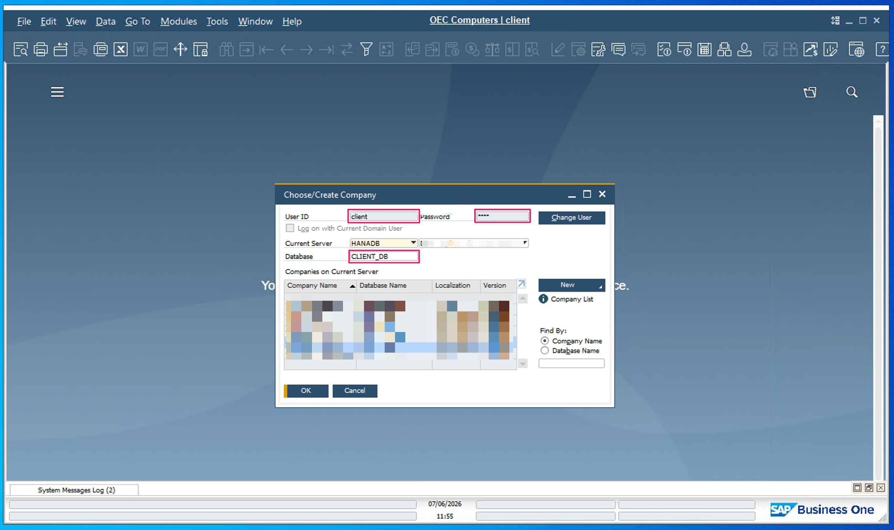

## Overview

[SAP Business One](https://www.sap.com/products/erp/business-one.html) is an enterprise resource planning (ERP)
solution designed for small and midsize businesses by SAP SE. Its
[Service Layer](https://help.sap.com/docs/SAP_BUSINESS_ONE_ONE_BRANCH) exposes the Business One business objects
through an OData web service interface.

The SAP Business One Localization & Electronic Documents connector provides APIs for the country-specific and electronic document objects of SAP Business One: electronic documents and file formats, Brazil Nota Fiscal codes, India GST data, Israel deduction documents, and more, exposed through the [SAP Business One Service Layer](https://help.sap.com/docs/SAP_BUSINESS_ONE_ONE_BRANCH) (OData).

### Key Features

- Process electronic documents and communication actions
- Maintain Brazil Nota Fiscal, CEST, and NCM code setup
- Manage India HSN/SAC codes and e-way bill transporters
- Work with Israel deduction (ISD) documents

## Setup guide

The connector requires an SAP Business One installation with the Service Layer component enabled.

To connect, you need three values from the SAP Business One desktop client's login screen: the company database,
your user name, and your password.

Click the company name at the top of the SAP Business One desktop application, or contact your administrator.



> **Tip:** The **Current Server** field identifies the SAP HANA or SQL Server instance behind the Service Layer, not
> the Service Layer itself — it is not part of the connector configuration. Ask your SAP administrator for the
> Service Layer's own address if you do not already have it.

## Quickstart

To use the `sap.businessone.localization` connector in your Ballerina application, modify the `.bal` file as follows:

### Step 1: Import the module

```ballerina
import ballerinax/sap.businessone.localization;
```

### Step 2: Instantiate a new connector

The connector authenticates with the Service Layer session protocol: it logs in with the configured company
database, user name, and password, tracks the `B1SESSION`/`ROUTEID` cookies, and transparently re-logs in once
when the session expires. Place the credentials in a `Config.toml` (never commit credentials to source control):

```toml
serviceUrl = "https://<host>:50000/b1s/v1"
companyDb = "<COMPANY_DB>"
username = "<USER>"
password = "<PASSWORD>"
```

```ballerina
configurable string serviceUrl = ?;
configurable string companyDb = ?;
configurable string username = ?;
configurable string password = ?;

localization:Client b1Client = check new (
    {companyDb, username, password},
    serviceUrl = serviceUrl
);
```

### Step 3: Invoke the connector operation

```ballerina
localization:ElectronicDocuments_CollectionResponse response = check b1Client->electronicDocumentsList();
```

### Step 4: Run the Ballerina application

```bash
bal run
```

## Examples

The SAP Business One connectors provide practical examples illustrating usage in various scenarios. Explore these
[examples](https://github.com/ballerina-platform/module-ballerinax-sap.businessone/tree/main/examples), covering
use cases like listing open sales orders, reporting inventory stock, and logging CRM activities.
